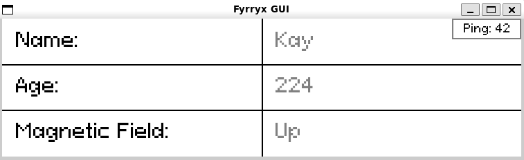

# Fyrryx - a EEERover project

This repository contains the code developed as part of the Electronics Design
Project (ELEC40006) completed in June 2023.

## Dependencies

- pygame (for handling controller)
- ArduinoJson.h

To resolve, run this command in the terminal. If you don't have pip installed there are guides for installing pip (the python module installer).

```bash
pip install pygame
```

On Linux:

```bash
sudo apt install wireless-tools
```

## Folder structure

[`OrangePip`](OrangePip) contains the Arduino code for the secondary device.

[`server`](server) contains the Arduino code for the main device 
(AdaFruit Metro M0).

[`controller`](controller) contains the Python code for the client controller.
A picture is shown below.



## Final Product


<video src="images/rover.mp4" controls title="Rover in Action"></video>